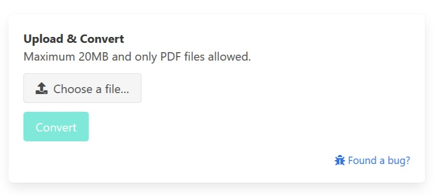

# PDFtk Web Service

Web UI to process PDFs through PDFtk.



## Deployment

To install the application simply run deployment script, that calls docker build and docker run:

```bash
./deploy.sh
```
The application will be served on localhost port 80.

## Usage

Navigate to application root and upload your PDF. After processing it will be available for download.